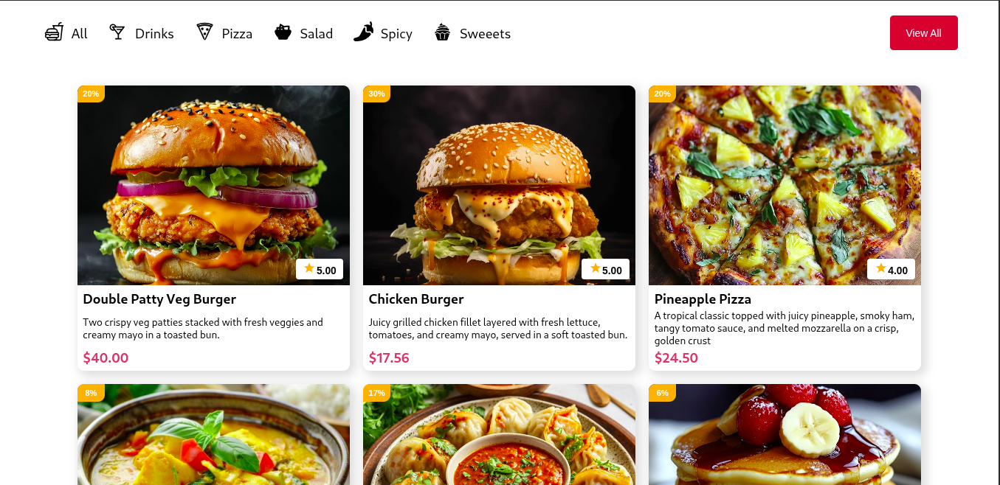

# 🍔 Snack Stack

A responsive React-based food menu web app showcasing a variety of food categories and item listings. Features smooth hover effects, category icons, and dynamic content display.



## 🛠 Tech Stack

- **React**
- **CSS**
- **React Icons**
- **Vite** 

## Getting started

```bash
git clone https://github.com/charles-254/snack-stack.git
cd snack-stack
npm install
npm run dev
```
